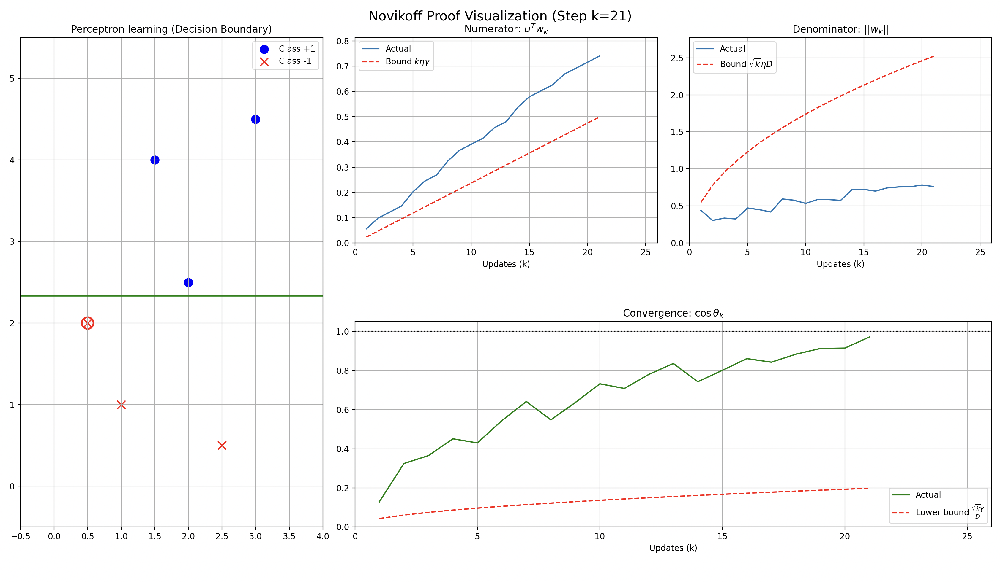

# パーセプトロンの収束定理（Novikoffの定理）

 

 ## 1. 全体の概要

 このシミュレーションは、パーセププトロンが分類境界を学習する過程を描くだけでなく、「なぜパーセプトロンが有限回の更新で必ず停止（収束）するのか」という Novikoff の証明プロセスを可視化したものだ。

 Novikoff の定理は、データが線形分離可能であるとき、誤分類による重み更新回数 $k$ が有限であり、次の上界を持つことを示す。

 $$k \le \left( \frac{D}{\gamma} \right)^2$$

 ここで $\gamma$ は幾何学的マージン（最小の分類余裕）、$D$ はデータ点ノルムの最大値（データの「大きさ」の上限）である。

 本可視化では、この不等式が成立するまでの論理を、4つのグラフで段階的に追跡している。

## 2. 各グラフの解説

### 左：学習の様子（Decision Boundary）

 - 内容
   青（ラベル $+1$）と赤（ラベル $-1$）のデータに対して、現在の重み $w_k$ が作る境界線（緑）がどのように移動するかを示す。

 - ポイント
   赤い丸で囲まれた点が、そのステップで誤分類された点であり、重み更新のトリガーになったデータだ。更新を重ねることで、境界線が徐々に正しい分離位置へ近づいていく様子が確認できる。

### 右上：分子の挙動（Numerator: $u^\top w_k$）

 - 数式の意味
   理想の分離方向を表す単位ベクトル $u$ と、現在の重み $w_k$ の内積であり、「どれだけ正解方向に進んでいるか」を測る量だ。

 - 理論
   誤分類が起きるたびに、重みは正解方向 $u$ へ少なくとも $\eta\gamma$ だけ近づく。したがって次の不等式が成り立つ。

 $$u^\top w_k \ge k\eta\gamma$$

   よって、青線（実測値）は赤点線（理論下界）を常に上回る必要がある。

 - 観測
   実際に青線は赤点線より上で推移しており、更新が一貫して正しい方向への進みを蓄積していることが分かる。

### 右中：分母の挙動（Denominator: $\|w_k\|$）

 - 数式の意味
   現在の重みベクトル $w_k$ の長さ（ノルム）であり、重みの「大きさ」の成長を表す。

 - 理論
   更新により重みは増大するが、誤分類点での更新であることから増大速度には上限がつく。具体的には次が成り立つ。

 $$\|w_k\| \le \eta D\sqrt{k}$$

   したがって青線（実測値）は赤点線（理論上界）を超えない。

 - 観測
   青線は赤点線より十分低い位置で推移しており、重みが無制限に発散しないことを示している。

### 右下：収束の核心（Convergence: $\cos\theta_k$）

 - 数式の意味
   分子と分母の比として

 $$\cos\theta_k=\frac{u^\top w_k}{\|w_k\|}$$

   を考える。これは理想方向 $u$ と現在の重み $w_k$ のなす角 $\theta_k$ のコサインであり、「方向がどれだけ一致しているか」を直接示す指標だ。

 - ロジック

   1. 定義より常に

 $$\cos\theta_k \le 1$$

      が成り立ち、黒点線はこの上限を表している。
   2. 一方、Novikoff の議論から次の時間とともに増加する下限が得られる。

 $$\cos\theta_k \ge \sqrt{k}\frac{\gamma}{D}$$

      これが赤点線である。
   1. 下限は $\sqrt{k}$ に比例して増えるため、やがて 1 に達し、それ以上更新を続ける余地がなくなる。

 - 結論
   赤点線（下限）が 1 にぶつかる地点が理論上の最大更新回数であり、実際の学習（緑線）はその手前で 1 に近づいて誤分類が消え、収束して停止する。

## 3. コード上の工夫（Technical Note）

 この証明を可視化するには、本来未知であるはずの「理想的な分離方向 $u$」と「マージン $\gamma$」を事前に求める必要がある。

 - 本コードでは `sklearn.svm.LinearSVC` により最大マージン分類器（SVM）を学習し、その法線ベクトルを理想方向 $u$ として利用している。
 - この「正解（Oracle）」を基準に、$\gamma$ と $D$ を計算し、理論境界（赤点線）を描画している。

 この工夫により、パーセプトロンの更新過程と Novikoff 証明の各不等式が、同じ時間軸上で比較できる形に落とし込まれている。

